# CS2107 Assignment 1 Writeup

## E0. Sanity Check
We scroll down to the last page of the assignment document, where we find our first flag.
  
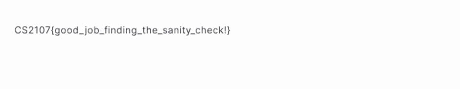

## E1. Caesar Salad
Looking at the name of the challenge it seemed like a caesar cipher. Let’s try an online decoder. (Decoded on the left, cipher on the right).

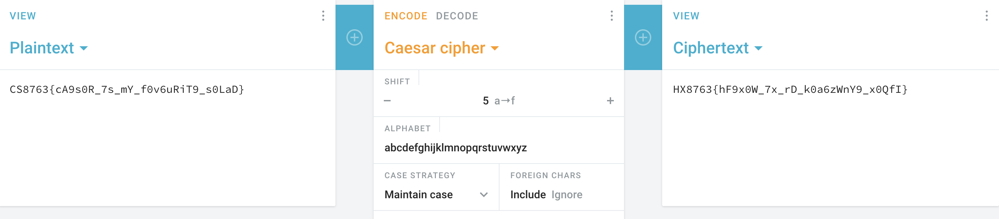
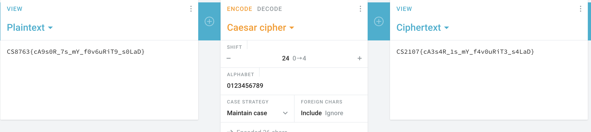

We get the flag and submit it!

## E2. Birds of a Feather
Got trolled so hard on this question. Turns out all there was to do was to search ‘bird cipher’ on google, which gave us this image.

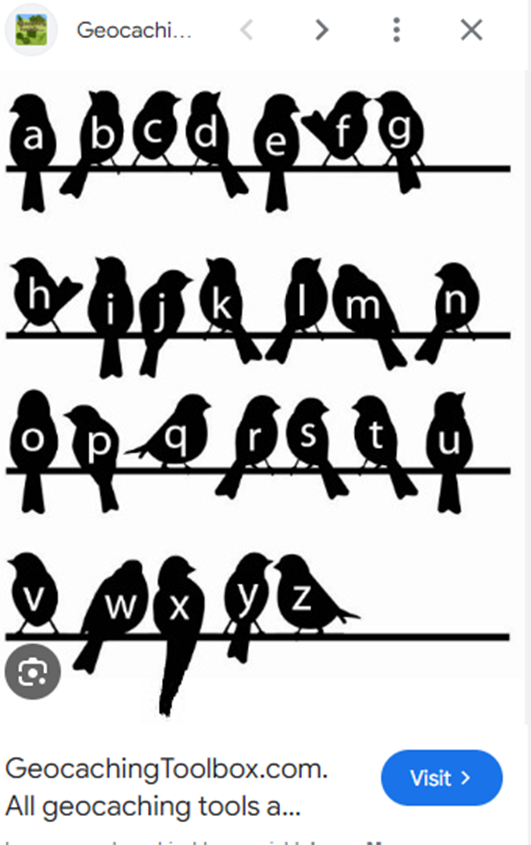

## E3. Xoring gone wrong
Our file gives us 6 keys, each of which is generated in a different way. 

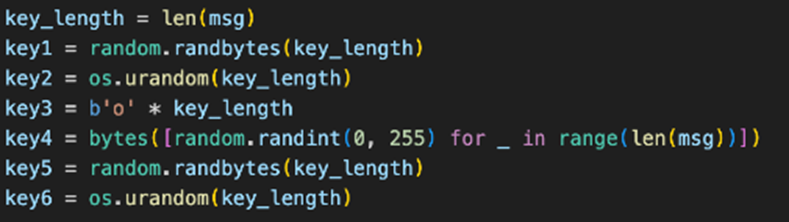

Looking at the encrypt and XOR functions, it seems like the message is being bitwise XOR ed by each of the keys.

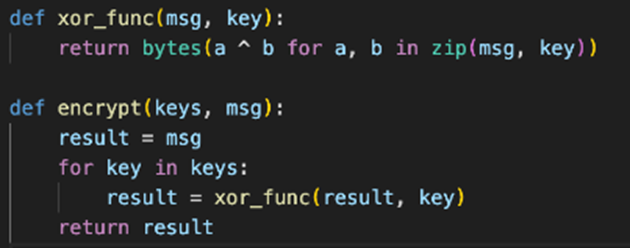

We recall that a ^ a ^ b = b, effectively cancelling out the key. Thus, we run the encrypt function once again on all 6 keys and obtain the flag.

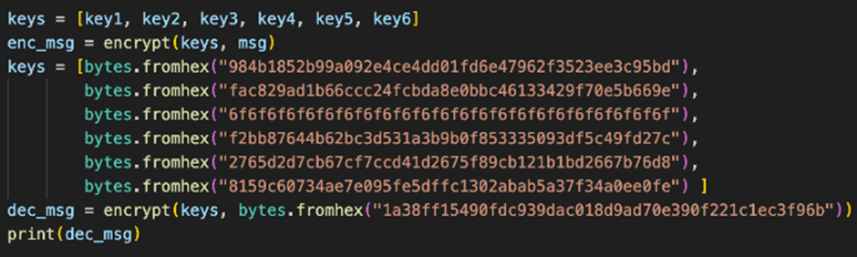

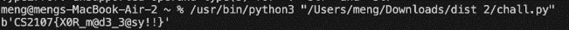

## M2. Baby rsa
This challenge was similar to one I had done in another CTF. We are given some variables, and must crack the rsa encryption.
We follow these steps:
-	d must satisfy the following equation: e*d = 1 mod [(p-1)(q-1)]
-	m=c^d mod (pq)
-	convert the bytes to a string  

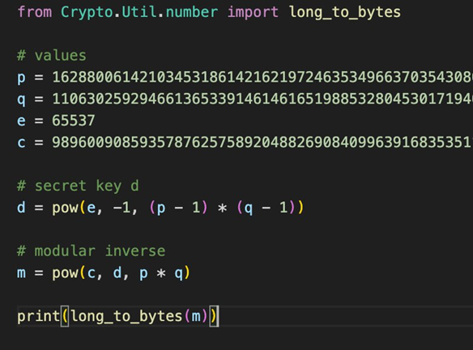

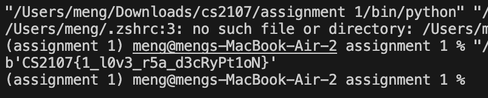

Using the code above, we got the flag!

## M3. Flag frequency
As the name suggests, we should probably test a frequency checker. Using the website https://planetcalc.com/8047/, we successfully find the flag!

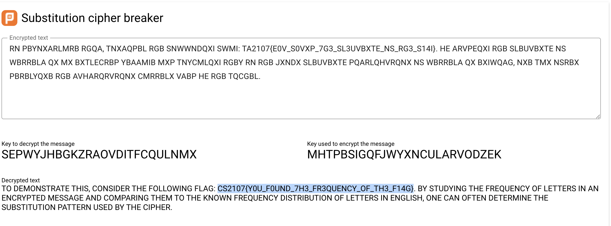

## H2. Re-al or Fa-ke
The way the question is phrased makes me think that python’s rng is not actually rng. After a bit of research, I found this website that provides this explanation of how to crack the rng.

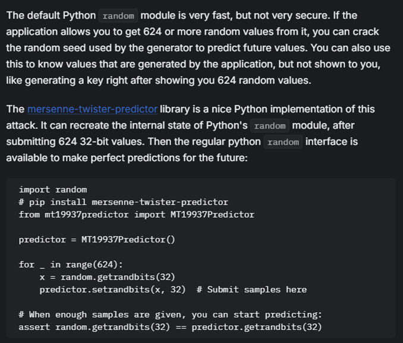  

Interesting! I wrote the following script to get the flag:  

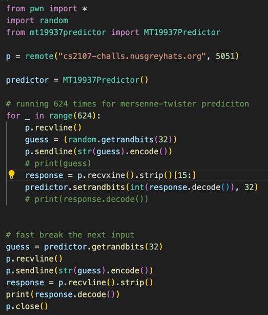  

We get a number from the server 624 times to get the required data for the seed. Then, we send the next input almost immediately, and get the flag from the server!

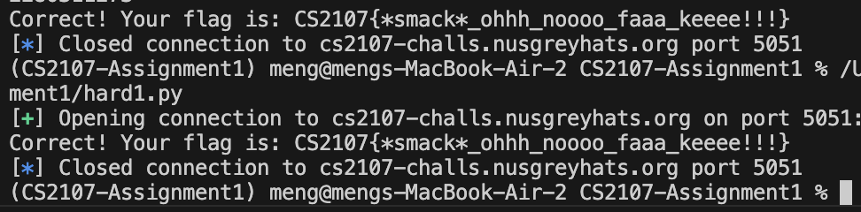

## References 
https://github.com/NUSGreyhats/welcome-ctf-2024-public/blob/main/crypto/rsa-school/distribution/chal.py for M2

https://planetcalc.com/8047/ for M3

https://book.jorianwoltjer.com/cryptography/pseudo-random-number-generators-prng for H2
