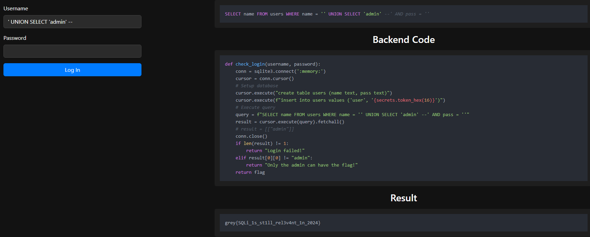

**Stack BOF School (PWN) - Solved by yalim**  
Write nonsense until we reach the return line, then write the flag address in little endian

**Boss Fight (PWN) - Solved by yalim**
Make the boss' health overflow past 32768 - idk how I didn't try or think of this

Greyllm (MISC)
1. Asked the chatbot for the flag
2. It said it could not reveal full, so i asked it for a partial and it gave "w0w_you_cant_always_be_direct_huh" which is the whole flag

**Read read read (MISC)**
1. Unzipped microsoft word doc with 7zip
2. Inspected the header1.xml to find flag
Learnt: microsoft docs are hidden zip files

Aimfactory (WEB)
1. Change score in console log and submtiScore(1000) to get flag

SQLi 1 (WEB)
1. Command ' UNION SELECT 'admin' --, which creates the length of 1 and also removes password check

Explanation (GPTed):  
- '': This effectively makes the condition false for the original name = 'user', but it’s overridden by the UNION part.
- UNION SELECT 'admin': The UNION clause combines the results of the original query with a new result set that contains 'admin'. This forces the query to return 'admin' as part of its results.
- --: The comment ensures that the rest of the query (e.g., AND pass = 'w') is ignored.

SQLi 2 (WEB)
1. Same idea, find the user password instead

- ' UNION SELECT pass FROM users -- 

PCAP 1 (FORENSICS)
1. Open pcap in wireshark
2. Follow the HTTP login stream

Lorem Ipsum (FORENSICS)
1. File was a PDF, opened in notepad, ctrl f -> flag was grey{l0r3M_1pSUm_3XifT0oL} so prob can use exif

Hello kitty (FORENSICS)
1. Tried a shit ton of cmd line tools (stegsolve / exiftools / xxd / steghide) -> all failed then just used https://futureboy.us/stegano/decode.pl and it worked WTF MAN

Shoulder peeking (FORENSICS)
1. Found audit login fails -> looked at users: there were 2: rebecca and daniel but rebecca’s was more spaced together (2s apart)
2. Checked for first success after the fails

Windows flag checker (REV)
1. Open in cff explorer, find the hex to plaintext

Linux flag checker (REV)
1. Decompiled at https://dogbolt.org/ and code has flag in it

No math crypto (CRYPTO)
1. Use online site https://www.guballa.de/substitution-solver but flag points to https://quipqiup.com/

RSA (CRYPTO)
1. Self-explanatory help: should read up more about it. Mainly GPT-ed  

params:  
p = 10918311508953460494712654527779080336321393782191731265090553157872794490868081977616381704507764350624871787735778119076851518302788040369052752258947443
q = 13275551522486616735703446932912517581753633626519470930436586509196008502354746481220757134944626046803204486283771742983058840097159145430953539904641457
e = 65537

----------------[setup]-------------------  
Here is the ciphertext, which is computed by c=m^e mod N where m is the message  
c = 61226191959841950045593716714957920903275614998708269477340360680366946740283888881387574625517952478635163607888097067352357022416351774332376038367624778277846665884495960669358666648683563209730395154465529191828062452080845088668801418575950931935586241660354948285141585860605256948441228236614466025674

----------------[step 1]-------------------  
To recover m, we first compute the private key d.  
d must satisfy the following equation: e*d = 1 mod [(p-1)(q-1)]  
Hint: look up modular inverse  
d = 36589966977516346764375097952735197743969044262822125012495310835826761500264847089690866782274159568729451028295614769885536904984425569082540017876351868797447108183025174789916129327741822068618357854162185047029437708206901151183900602254316950608109486279721876125084536485295608578180893156014624029697
----------------[step 2]-------------------  
Now, compute m=c^d mod (pq)  
Hint: look up modular exponentiation  
m = 4481624626718542717349837486688775099814995281362698048681549428000637959668628458054185647086618565781516614589000946128017437565
----------------[flag]-------------------  
Now convert m to a string and submit it as a flag!  
Hint: pycryptodome long_to_bytes  
----------------[why does it work]-------------------  
Notice that x^(p-1) mod p = 1 and x^(q-1) mod q = 1 for any x (coprime to N)  
Hence x^[k*(p-1)(q-1)+1]=x mod (pq) for any k  
Hence (x^e)^d=x mod N for any x where N=pq  

