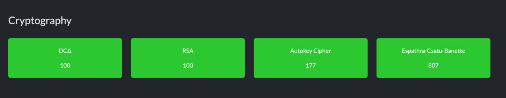
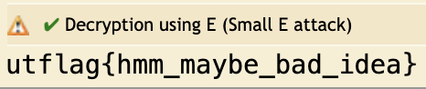
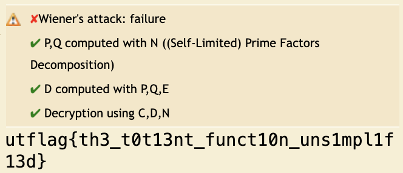
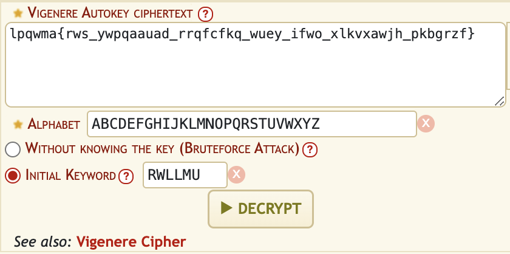
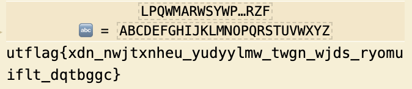
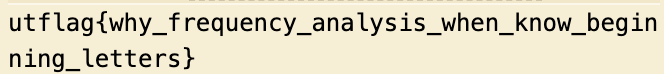
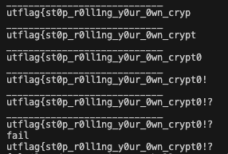
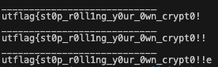

# UTCTF 25 Writeup

## Introduction
FULL CLEAR CRYPTO BABY!! Stayed awake till like 3 to solve ECB, but it was so satisfying to get my first category full clear.



## Crypto
### RSA | DCΔ
Use [this website](https://www.dcode.fr/rsa-cipher) and key in the respective values for n, e and c. We can use this for both flags!  



<br></br>
### Autokey Cipher
We are given a string `lpqwma{rws_ywpqaauad_rrqfcfkq_wuey_ifwo_xlkvxawjh_pkbgrzf}`.
We know that the first few letters of the string will be utflag, and so we engineer the autokey cipher based on that.

The thing about autokey ciphers is that each letter in the keyword corresponds to a letter that is encrypted, i.e we only use `R` to encrypt/decrypt the first letter `L`, `W` to decrypt the second letter `P` and so on. Using an online autokey table or just by smart bruteforcing, we are able to get the first 6 letters of the keyword.  





At this point the flag looks something like the image above. We can extend the keyword by trying to make `xdn` into common words such as `the`, `you`, and eventually `why`. We get the final keyword `RWLLMUVP` which gives us the flag.  



<br></br>

### Espathra-Csatu-Banette
A noob's version of ECB solve. Code is [here](ecb.py) for reference. Note: running code on the server is wonky, running the same payload mutiple times can lead to different results (from my own experience).

```python
#!/usr/bin/env python3

from Crypto.Cipher import AES
from Crypto.Util.Padding import pad
key = open("/src/key", "rb").read()
secret = open("/src/flag.txt", "r").read()
cipher = AES.new(key, AES.MODE_ECB)

while 1:
    print('Enter text to be encrypted: ', end='')
    x = input()
    chksum = sum(ord(c) for c in x) % (len(x)+1)
    pt = x[:chksum] + secret + x[chksum:]
    ct = cipher.encrypt(pad(pt.encode('utf-8'), AES.block_size))
    print(hex(int.from_bytes(ct, byteorder='big')))
```

We are given this code, where the flag is encrypted with AES ECB mode and placed in the middle of our input based on a checksum.

The first thing to note is that AES ECB is deterministic, and returns the same value if the plaintext is the same. Additionally, ECB also encodes by blocks, and with the AES block size of 128 bits / 16 bytes, as long as each block of plaintext fed into the cipher is the same, the output will be the same.

Thus we have this attack method: 
1. Obtain a hash with the first block containig all the letters we know so far and one unknown at the back. This is done by sending a payload of `x` characters, where `x = 16 - known - 1`. i.e if we know 8 characters, we send a payload of 7 characters, such that we have `xxxxxxxzzzzzzzzy` as the first block plaintext to encode, where `z` is characters we know and `y` is the character we are bruteforcing.
2. Iterate through all the ASCII printable characters for the unknown, and stop when the two hashes are the same.

We can see the same ideas [online](https://exploit-notes.hdks.org/exploit/cryptography/algorithm/aes-ecb-padding-attack/).


The first thing we need to do is to place the secret all the way at the end, meaning that `pt = x + secret`. To do this, sending a payload of `\x01` * (number of x) ensures that the checksum is always `len(payload)`.

We start the payload with 8 `\x01`, because we know the first 7 bytes of the flag which is `utflag{`  

```python
godload = '\x01' * 8 # 8
cracked = 'utflag{'  # 7
# 1 remaining byte for bruteforce
```


We send the payload to the server, and take the first 32 hex digits = 16 bytes. We use `[2:34]` because the return value has an appended `0x` at the front i.e `0x8fe8c23e...` 


```python
conn.recv(1024).decode()
conn.sendline(godload)
currCrack = conn.recvline().decode()[2:34]
```

After that, we try to get the same first block through bruteforcing characters.

```python
for char in chars:
    payload = godload + cracked + char + padding

    chksum = sum(ord(c) for c in payload) % (len(payload)+1)
    totalSum = sum(ord(c) for c in payload)

    if chksum < len(payload):
        newchk = totalSum % (len(payload)+2)
        val = len(payload) + 1 - newchk

        if val == 0:
            val = len(payload) + 1
        payload += chr(val)

    chksum = sum(ord(c) for c in payload) % (len(payload)+1)
    conn.recv(1024).decode()
    conn.sendline(payload.encode())
    testVal = conn.recvline().decode()[2:34]

    if currCrack == testVal:
        cracked += char
        found = True
        break
```

Here is where I got stuck. I am not sure of the cause exactly, perhaps something to do with perfect 16-byte blocks and no padding. I was unable to get any values until I added a padding to the back of the payload, which for the first 2 blocks can be any valid padding (e.g `hex(0x01)` or `hex(0x02) * 2`). After getting past this hurdle, we can continue this method for the rest of the block, getting the partial output of `utflag{st0p_r0ll`.

We then repeat the process for the second block, changing the `godload`, `cracked` and string indexes accordingly.

```python
godload = '\x01' * 15 # 15
cracked = 'utflag{st0p_roll'  # 16
# 1 remaining byte for brueforce
...SNIP...
currCrack = conn.recvline().decode()[34:66]
...SNIP...
testVal = conn.recvline().decode()[34:66]
```

Again, we do the same for the third block. We can see from the images below that the output is inconsistent, even when sent with the same payload. I have tried `hex(0x02) * 2` and `hex(0x03) * 3` which both gave correct results, and `hex(0x01)`, which gave both results below. (Would love an explanation if anyone is willing to share!)

  




After all of that, we get the flag!  
`utflag{st0p_r0ll1ng_y0ur_0wn_crypt0!!}`


### Full Code
```python
from pwn import *

host = 'challenge.utctf.live'
port = 7150

conn = remote(host, port)

chars = 'abcdefghijklmnopqrstuvwxyzABCDEFGHIJKLMNOPQRSTUVWXYZ0123456789_-~!?#%&@{}' 
godload = '\x01' * 12 # 15

# block 1
# cracked = 'utflag{'  # 7

# block 2
# cracked = 'utflag{st0p_r0ll' # 16=

# block 3
cracked = 'utflag{st0p_r0ll1ng_y0ur_0wn_crypt0' # 32
padding = hex(0x03) * 3

# each block change chksum value, 16 to 32 to 48
# padding is any random valid hex padding
# last part: brute force padding addition to the code

while (True):
    found = False
    conn.recv(1024).decode()
    conn.sendline(godload)
    currCrack = conn.recvline().decode()[66:98]

    for char in chars:
        payload = godload + cracked + char + padding

        chksum = sum(ord(c) for c in payload) % (len(payload)+1)
        totalSum = sum(ord(c) for c in payload)

        if chksum != len(payload):
            newchk = totalSum % (len(payload)+2)
            val = len(payload) + 1 - newchk

            if val == 0:
                val = len(payload) + 1
            payload += chr(val)

        chksum = sum(ord(c) for c in payload) % (len(payload)+1)
        conn.recv(1024).decode()
        conn.sendline(payload.encode())
        testVal = conn.recvline().decode()[66:98]

        if currCrack == testVal:
            cracked += char
            found = True
            break
        
    print("____________________________")
    print(cracked)

    if not found:
        print("fail")
        break

    if len(godload) == 0:
        break
    godload = godload[:-1]

print(cracked)
```