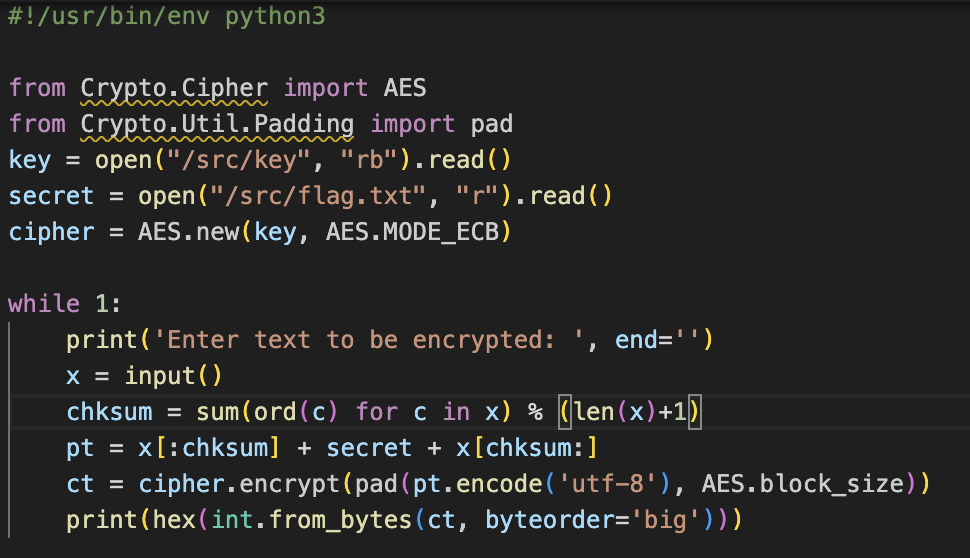
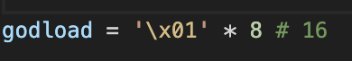
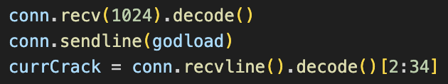

# UTCTF 25 Writeup

## Introduction
FULL CLEAR CRYPTO BABY!! Stayed awake till like 3 to solve ECB, but it was so satisfying to get my first category full clear.

## Crypto
### RSA | DCΔ
Use [this website](https://www.dcode.fr/rsa-cipher) and key in the respective values for n, e and c. We can use this for both flags!  

  
### Autokey Cipher
We are given a string `lpqwma{rws_ywpqaauad_rrqfcfkq_wuey_ifwo_xlkvxawjh_pkbgrzf}`.
We know that the first few letters of the string will be utflag, and so we engineer the autokey cipher based on that.

The thing about autokey ciphers is that each letter in the keyword corresponds to a letter that is encrypted, i.e we only use `R` to encrypt/decrypt the first letter `L`, `W` to decrypt the second letter `P` and so on. Using an online autokey table or just by smart bruteforcing, we are able to get the first 6 letters of the keyword.  

At this point the flag looks something like the image above. We can extend the keyword by trying to make `xdn` into common words such as `the`, `you`, and eventually `why`. We get the final keyword `RWLLMUVP` which gives us the flag.  

  

### Espathra-Csatu-Banette
Man this was a tough challenge. Let's go through it. Code is [here](ecb.py) for reference.

We are given this code, where the flag is encrypted with AES ECB mode and placed in the middle of our input based on a checksum.

The first thing to note is that AES ECB is deterministic, and returns the same value if the plaintext is the same. Additionally, ECB also encodes by blocks, and with the AES block size of 128 bits / 16 bytes, as long as each block of plaintext fed into the cipher is the same, the output will be the same.

Thus we have this attack method: 
1. Obtain a hash with the first block containig all the letters we know so far and one unknown at the back. This is done by sending a payload of `x` characters, where `x = 16 - known - 1`. i.e if we know 8 characters, we send a payload of 7 characters, such that we have `xxxxxxxzzzzzzzzy` as the first block plaintext to encode, where `z` is characters we know and `y` is the character we are bruteforcing.
2. Iterate through all the ASCII printable characters for the unknown, and stop when the two hashes are the same.

We can see the same ideas [online](https://exploit-notes.hdks.org/exploit/cryptography/algorithm/aes-ecb-padding-attack/).

The first thing we need to do is to place the secret all the way at the end, meaning that `pt = x + secret`. To do this, sending a payload of `\x01` * (number of x) ensures that the checksum is always `len(payload)`.

We start the payload with 8 `\x01`, because we know the first 7 bytes of the flag which is `utflag{`  

We send the payload to the server, and take the first 32 hex digits = 16 bytes. We use `[2:34]` because the return value has an appended `0x` at the front i.e `0x8fe8c23e...` 

<!-- Focusing on the first 16 bytes, we want to send 16 characters such that the first AES block is something like `xxxxxxxxutflag{y`, where the first 8 `x`s represent a random number and `y` represents characters that we will brute force. -->

